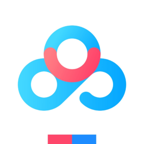
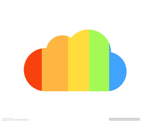
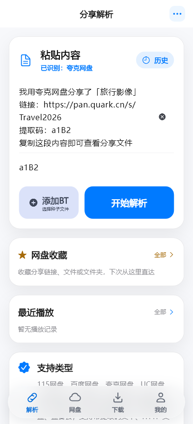
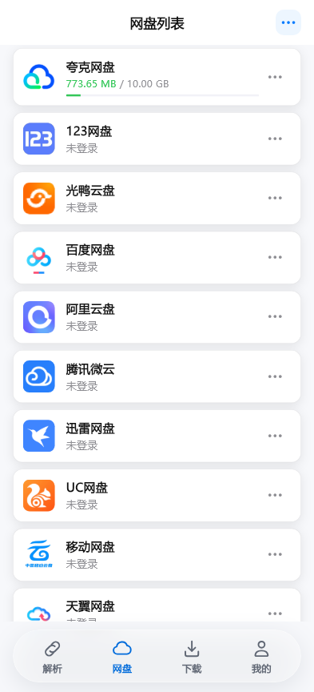
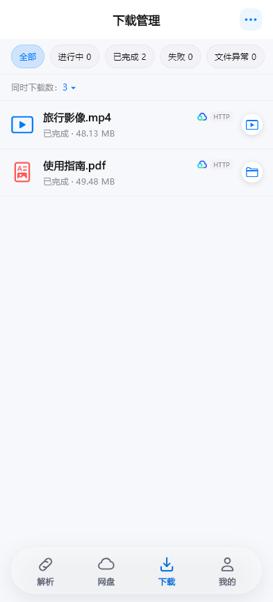
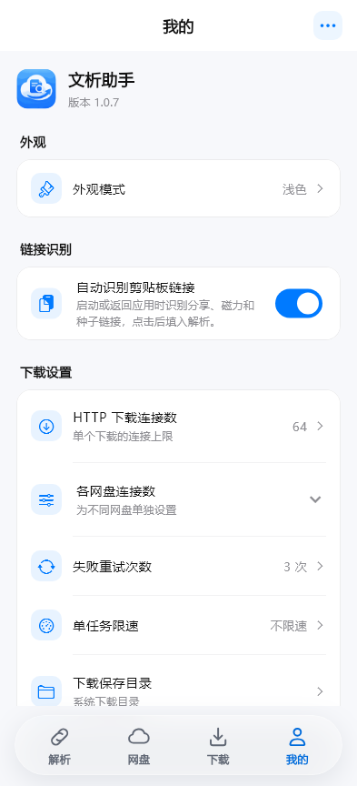
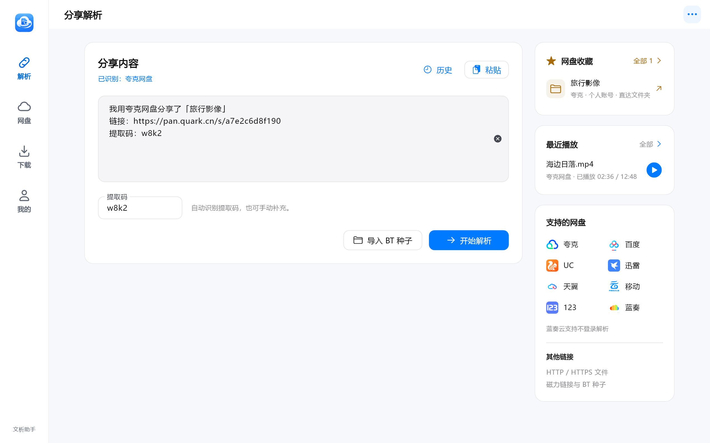

  
  <h1>文析助手 · AsterLink</h1>
  
一个安卓+PC的双端聚合网盘解析软件。

  

    
    
    
  

  

    <a href="#项目介绍">项目介绍</a> · <a href="#下载">下载</a> · <a href="#功能">功能</a> · <a href="#安卓界面">安卓截图</a> · <a href="docs/BUILDING.md">编译</a> · <a href="CHANGELOG.md">更新记录</a>
  

## 项目介绍

**文析助手（AsterLink）** 是一款面向 Android 和 Windows 的免费网盘管理与下载应用，支持分享链接解析、个人网盘浏览、文件上传下载和音视频在线播放。目前已接入 **14 个网盘**，可以管理不同平台的多个账号。

## 下载

在本仓库 **Releases** 页面获取安装包。

| 平台 | 安装包 | 系统要求 |
| --- | --- | --- |
| Android | arm64 APK | Android 7.0 及以上 |
| Windows | x64 安装包 | Windows 10 / 11 |

## 支持网盘

已接入 **14 个网盘**，其中 **12 个支持分享解析**。

<table>
  <tr>
    <td align="center" width="25%"> <strong>夸克网盘</strong></td>
    <td align="center" width="25%"> <strong>UC 网盘</strong></td>
    <td align="center" width="25%"> <strong>迅雷云盘</strong></td>
    <td align="center" width="25%"> <strong>百度网盘</strong></td>
  </tr>
  <tr>
    <td align="center" width="25%"> <strong>123 云盘</strong></td>
    <td align="center" width="25%"> <strong>中国移动云盘</strong></td>
    <td align="center" width="25%"> <strong>天翼云盘</strong></td>
    <td align="center" width="25%"> <strong>光鸭云盘</strong></td>
  </tr>
  <tr>
    <td align="center" width="25%"> <strong>阿里云盘</strong></td>
    <td align="center" width="25%"> <strong>蓝奏云</strong></td>
    <td align="center" width="25%"> <strong>中国联通云盘</strong></td>
    <td align="center" width="25%"> <strong>115 网盘</strong></td>
  </tr>
  <tr>
    <td align="center" colspan="2"> <strong>蓝奏云优享版</strong> 个人盘</td>
    <td align="center" colspan="2"> <strong>腾讯微云</strong> 个人盘</td>
  </tr>
</table>

## 功能

- [x] **分享链接解析**：识别网盘链接与提取码，支持粘贴完整分享文案、多条链接识别和解析历史；可手动修改提取码后重试。
- [x] **多网盘与多账号**：在不同网盘及账号之间切换，自定义账号名称；下载、播放和收藏保留各自的账号归属。
- [x] **文件管理**：浏览个人网盘，上传文件、新建文件夹，并按平台能力提供重命名、移动、删除和分享操作。
- [x] **统一下载管理**：支持 HTTP / HTTPS、网盘文件、磁力链接和 BT 种子；可设置连接数、同时下载任务数及限速，支持暂停、继续、失败重试和批量删除记录。
- [x] **图片与文本预览**：直接查看网盘中的图片和文本，方便先确认内容再决定是否下载。
- [x] **音视频在线播放**：内置播放器提供倍速、字幕与音轨切换、播放记录和断点续播；手机端可选择第三方播放器，支持的下载任务可边下边播。
- [x] **分享与文件收藏**：收藏分享链接、文件或文件夹。链接与提取码一起保存，再次打开时重新解析，文件收藏可定位到原目录。
- [x] **下载悬浮窗与悬浮球**：安卓端手动开启，实时查看下载进度；支持拖动、调整宽高和收起，使用其他应用时也能查看任务状态。
- [x] **加密备份与恢复**：使用备份密码导出账号、设置和收藏，便于换设备或重装后恢复。
- [x] **浅色与深色外观**：适配手机与桌面布局，按自己的使用习惯切换主题。

## 使用

1. **添加账号**：在“网盘”页选择平台并登录，进入个人网盘管理文件。
2. **解析分享**：在“解析”页粘贴链接或完整分享文案，核对提取码后开始解析。
3. **选择操作**：浏览文件并下载或预览；点击文件列表顶部的星标，可以收藏整个分享。
4. **管理任务**：在“下载”页查看进度、暂停续传或批量删除记录；安卓端也可手动开启下载悬浮窗。

## 安卓界面

| 分享解析 | 网盘管理 |
| :---: | :---: |
|  |  |
| **下载管理** | **设置** |
|  |  |

查看 Windows 界面

Windows 图片为较早版本界面示意。

## 编译与反馈

使用 Flutter 3.41.4、Dart 3.11.1 和 Go 1.24.7，详见 [编译说明](docs/BUILDING.md)。

问题和建议欢迎提交 **Issues**，请附上版本、系统、操作步骤及脱敏错误提示，不要上传账号密码、Cookie 或账号备份。

项目采用 [AGPL-3.0](LICENSE)，基于 Flutter、Gopeed 和 media_kit 构建。第三方组件保留各自许可，网盘名称及标识归对应服务所有，本项目并非网盘官方客户端。

[发布说明](docs/GITHUB-PUBLISH.md) · [隐私说明](docs/PRIVACY.md) · [第三方声明](assets/licenses/THIRD_PARTY_NOTICES.md) · [许可证范围](docs/LICENSING.md)
